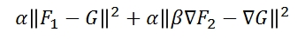

<H1>Distributed Gradient-Domain Processing of Planar and Spherical Images (Version 4.52)</H1>

<A HREF="#LINKS">links</A>
<A HREF="#DESCRIPTION">description</A>
<A HREF="#EXECUTABLE">executable</A>
<A HREF="#USAGE">usage</A>
<A HREF="#CHANGES">changes</A>

<A NAME="LINKS"><B>LINKS</B></A> 
<A href="http://www.cs.jhu.edu/~misha/MyPapers/ToG10.pdf">ToG 2010 Paper</A> 
<!--
<A href="http://www.cs.jhu.edu/~misha/Streaming2DMultiGrid/StJames/15/StJames.html">St James Visualization</A> 
-->
<A href="http://www.cs.jhu.edu/~misha/Code/DMG/DMG.exe.zip">Windows (x64) Executables</A> 
<A href="http://www.cs.jhu.edu/~misha/Code/DMG/DMG.zip">Source Code</A>  <A HREF="https://github.com/mkazhdan/DMG">GitHub Repository</A> 
(Older Versions:
<A href="http://www.cs.jhu.edu/~misha/Code/DMG/Version4.5/">Version 4.51 Page</A>
<A href="http://www.cs.jhu.edu/~misha/Code/DMG/Version4.5/">Version 4.5 Page</A>
<A href="http://www.cs.jhu.edu/~misha/Code/DMG/Version4.1/">Version 4.1 Page</A>
<A href="http://www.cs.jhu.edu/~misha/Code/DMG/Version4/">Version 4 Page</A>
<A href="http://www.cs.jhu.edu/~misha/Code/DMG/Version3.5/">Version 3.5 Page</A>
<A href="http://www.cs.jhu.edu/~misha/Code/DMG/Version3.11/">Version 3.11 Page</A>
<A href="http://www.cs.jhu.edu/~misha/Code/DMG/Version3.1/">Version 3.1 Page</A>
<A href="http://www.cs.jhu.edu/~misha/Code/DMG/Version3/">Version 3 Page</A>
<A href="http://www.cs.jhu.edu/~misha/Code/DMG/Version2/">Version 2 Page</A>
<A href="http://www.cs.jhu.edu/~misha/Code/DMG/Version1/">Version 1 Page</A>) 
<A href="license.txt">License</A> 

<A NAME="DESCRIPTION"><B>CODE DESCRIPTION</B></A> 
<UL>
This distribution provides an implementation of our distributed multigrid Poisson solver for image stitching, smoothing, and sharpenting:
<UL>
<LI><B>Stitching</B>: Given an input image consisting of composited images, and given a mask which assigns the same color ID to pixels coming from the same source image, our code outputs the stitched image whose gradients are a best-fit to the gradients of the composite image, with forced zero gradients across seam boundaries.
<LI><B>Smoothing/Sharpening/High-Low Compositing</B>: Given input low- and high-frequency images, a gradient modulation term, and a pixel fidelity term, our code outputs the best-fit image whose gradients match the modulated gradients of the high-frequency input image and whose pixel values match the pixel values of the input low-frequency image. Formally, if <I>F1</I> is the low-frequency image, <I>F2</I> is the high-frequency image, <I>&alpha;</I> is the fidelity term, and <I>&beta;</I> is the gradient modulation term, the output image <I>G</I> is the image minimizing the sum of square norms:

</UL>
Our system is implemented using a client-server model, and our distribution consists of two executables:
<UL>
<LI><B>ServerSocket</B>: This executable acts as the hub of the solver. Clients connect to it, it establishes all necessary connections and orchestrates the solver. It is also responsible for solving the linear system once multigrid has reduced the problem size to a size that can be solved on a single core.
<LI><B>ClientSocket</B>: This executable is the client-side of the solver, and is responsible for managing the solution of a subset of the image. The clients can be distributed across a network and only require that the subset of the image that they are responsible for is on a locally accessible disk. Since these clients can be run in a multi-threaded fashion, there should be no reason to run multiple clients off of the same physical machine.
</UL>

 
<B>NOTE:</B> This version of the code is cross-platform and compilation requires installation of <A HREF="http://www.boost.org">Boost</A>. (The code was developed and tested under Boost <A HREF="http://www.boost.org/users/history/version_1_55_0.html">version 1.55.0</A>.) 
The code also requires installation of the <i>zlib</i>, <i>png</i>, <i>tiff</i>, and <i>jpg</i> libraries to support image I/O. Source code for these is included for compilation using Visual Studios. The Makefile assumes that the header files can be found in <i>/usr/local/include/</i> and that the library files can be found in <i>/usr/local/lib/</i>.
</UL>

<A NAME="EXECUTABLE"><B>EXECUTABLE ARGUMENTS</B></A> 
<UL>
<LI><B><U>ServerSocket</U></B>:
<DL>
<DT><b>--count</b> &#60;<i>client count</i>&#62;
<DD> This integer specifies the number of clients that will be connecting to the server.

<DT>[<b>--port</b> &#60;<i>server port</i>&#62;]
<DD> This optional integer specifies the port at which the server should listen for client requests. If no port is specified, the server will ask the system to provide and one, and will print out the address and port to the command line.

<DT>[<b>--iters</b> &#60;<i>number of Gauss-Seidel iterations</i>&#62;]
<DD> This optional integer specifies the number of Gauss-Seidel iterations that should be performed per pass. (Default value is 5.)

<DT>[<b>--minMGRes</b> &#60;<i>coarsest resolution of the multigrid solver</i>&#62;]
<DD> This optional integer specifies the coarsest resolution at which Gauss-Seidel relaxation should be performed by the multigrid solver. Once the solver reaches this resolution, it solves using a conjugate-gradients solver. (Default value is 64.)

<DT>[<b>--inCoreRes</b> &#60;<i>in-core/out-of-core transition resolution</i>&#62;]
<DD> This optional integer specifies the transition at which the solver should switch from a distributed solver to a serial solver. (Default value is 1024.)

<DT>[<b>--verbose</b>]
<DD> If this optional argument is specified, the solver will output the magnitude of the residuals at the different levels.

<DT>[<b>--progress</b>]
<DD> If this optional argument is specified, the solver will show the progress of the solver through the restriction and prolongation phases.

<DT>[<b>--unknownType</b> &#60;<i>uknown label behavior</i>&#62;]
<DD> This optional integer specifies how pixels with white (255, 255, 255) labels should be treated. A value of <B>0</B> indicates that white should be treated as any other label color. A value of <B>1</B> indicates that the associated region should be filled in in black. A value of <B>2</B> indicates that the associated region should be filled in with a harmonic function. (Default value is 1.) 

<DT>[<b>--quality</b> &#60;<i>JPEG compression quality</i>&#62;]
<DD> This optional integer, in the range [0,100], specifies the compression quality that should be used if the output image is in JPEG format. (Default value is 100.)

<DT>[<b>--hdr</b>]
<DD> By default, the output image pixels are represented at 8 bits per pixel. When using either PNG or TIFF output, enabling this flag will output the images at 16 bits per pixel.

<DT>[<B>--gray</b>]
<DD> By default, the image pixels are assumed to be color. If they are gray, enabling this flag will reduce running time and memory usage by only solving for the single channel.

<DT> [<B>--deramp</B>]
<DD> Removes ramping artefact by subtracting off the average gradient.

<DT> [<B>--spherical/--cylindrical</B>]
<DD> If enabled, these flags indicate the image should be treated as either a spherical (TOAST parameterization) or cylindrical image so that the appropriate boundary continuity constraints are met.

<DT>[<B>--lump</B>]
<DD> If enabled, the mass-matrix is lumped to a diagonal.

<DT>[<B>--tileWidth</B> &#60;<i>iGrid tile width</i>&#62;]
<DT>[<B>--tileHeight</B> &#60;<i>iGrid tile height</i>&#62;]
<DT>[<B>--tileExt</B> &#60;<i>iGrid tile extnsion</i>&#62;]
<DD> When outputting to a tiled grid of images in <A HREF="iGrid.html">iGrid</A> format, these parameters specify the width, height, and file-type for the output tiles. The default resolution for the output tiles is 8192x8192 and the default file type is JPG.

<DT>[<B>--iWeight</B> &#60;<i>pixel fidelity term</i>&#62;]
<DD> If the system is solving the Poisson equation to perform image smoothing or sharpening, this value specifies the fidelity term &alpha;.

<DT>[<B>--gScale</B> &#60;<i>gradient modulation term</i>&#62;]
<DD> If the system is solving the Poisson equation to perform image smoothing or sharpening, this value specifies the gradient modulation &beta;.

</DL>
</UL>

<UL>
<LI><B><U>ClientSocket</U></B>:
<DL>

<DT><b>--pixels</b> &#60;<i>input composite/high-frequency image</i>&#62;
<DD> This string is the the name of the image file containing the image band that this client is responsible for. (Currently supported file-types include PNG, JPEG, BMP, WDP, TIFF, and our tiled image format <A HREF="iGrid.html">iGrid</A>.) The image height is unconstrained (though it must be the same across all clients). However, the width for all but the last band should be a multiple of a nice-power of two. (Roughly, the power should be equal to the number of levels over which the solver is parallelized.)

<DT><b>--lowPixels</b> &#60;<i>input low-frequency image</i>&#62;
<DD> This string is the the name of the image file containing the low-frequency image band that this client is responsible for. (Currently supported file-types include PNG, JPEG, BMP, WDP, TIFF, and our tiled image format <A HREF="iGrid.html">iGrid</A>.) The image height is unconstrained (though it must be the same across all clients). However, the width for all but the last band should be a multiple of a nice-power of two. (Roughly, the power should be equal to the number of levels over which the solver is parallelized.) If this file is not specified, the argument to <b>--pixels</B> is used for both low- and high-frequency content.

<DT><b>--labels</b> &#60;<i>input mask image</i>&#62;
<DD> This string is the name of the image file serving as the mask for stitching. (Since the values of the mask are used to determine if adjacent pixels in the composite image come from the same source, the mask should not be compressed using lossy compression. Similarly, in representing the composited pixels, be wary of using JPEG compression. Even at 100% quality, it can blur out the seams between images, so that setting the seam-crossing gradient to zero is no longer sufficient.) 
This parameter is required when performing stiching, as it lets the system know where to set the seam-crossing gradients to zero. However, when performing smoothing or sharpening (i.e. if a value is specified for either of the server parameters <i>--iWeight</i> and <i>--gScale</I>), then this parameter is ignored and the system assumes that all the pixels come from a single image.

<DT><b>--out</b> &#60;<i>ouput image</i>&#62;
<DD> This string is the name of the image to which the output will be written.

<DT><b>--address</b> &#60;<i>server address</i>&#62;
<DD> This string specifies the address to which the client should connect in order to establish a connection with the server.

<DT><b>--port</b> &#60;<i>server port</i>&#62;
<DD> This integer specifies the port to which the client should connect in order to establish a connection with the server.

<DT>[<b>--index</b> &#60;<i>client index</i>&#62;]
<DD> This optional integer specifies the index of the band within the whole image that the client is reponsible for. Indexing starts at zero, and if no value is specified, the client is by default assigned an index of zero.

<DT>[<b>--temp</b> &#60;<i>scratch directory</i>&#62;]
<DD> This optional string specifies the directory to which the temporary I/O streams used for storing data between the restriction and prolongation are to be written out.

<DT>[<B>--threads</B> &#60;<i>number of threads</i>&#62;]
<DD> This optional integer specifies the number of threads the client should spawn in order to solve its part of the problem. (Default value is 1.)

<DT>[<b>--inCore</b>]
<DD> By default, the executable assumes that the problem is large and uses a solver that streams the system to and from disk. If this argument is specified, the entire system will be solved in-core.
</DL>
</UL>

<A NAME="USAGE"><B>USAGE</B></A> 
For testing purposes, two sample datasets are provided.
<UL>
<LI> <A HREF="../PNC3/PNC3.zip">PNC3</A>: This dataset, courtesty of Matt Uyttendaele, consists of a panorama of 7 images resulting in an image of resolution 7,963 x 3,589. 
For distributed processing, the image and the mask are broken up into two roughly uniform-sized bands,  shown below. 
<TABLE BORDER=2>
<TR>
<TH>Composite
<TD></TD>
<TD></TD>
</TR>
<TR>
<TH>Mask
<TD></TD>
<TD></TD>
</TR>
<TR>
<TH>
<TH> Process 0 Bands
<TH> Process 1 Bands
</TR>
</TABLE>
To obtain the stitched image, we first run the server, letting it know that there will be two processes connecting to it:
<BLOCKQUOTE><CODE>
ServerSocket.exe --count 2
</CODE></BLOCKQUOTE>
which gives an output of:
<BLOCKQUOTE><CODE>
Server Address: 123.456.789.101:11213
</CODE></BLOCKQUOTE>
Using the address and the port, we can now start up the clients. We start the first client, specifying the input and output data, the address and port for connecting to the server, the number of threads to use for processing, and the index of the band:
<BLOCKQUOTE><CODE>
ClientSocket.exe --pixels pixels.0.png --labels labels.0.png --out out.0.jpeg --address 123.456.789.101 --port 11213 --threads 2 --index 0 --inCore
</CODE></BLOCKQUOTE>
Similarly, we start the second client:
<BLOCKQUOTE><CODE>
ClientSocket.exe --pixels pixels.1.png --labels labels.1.png --out out.1.jpeg --address 123.456.789.101 --port 11213 --threads 1 --index 1 --inCore
</CODE></BLOCKQUOTE>
The resulting, stitched, image bands are: 
<TABLE BORDER=2>
<TR>
<TD>
<TD>
</TR>
<TR>
<TH> Process 0 Output
<TH> Process 1 Output
</TR>
</TABLE>
Alternatively, if we just want to run on a single machine, we set up the server to expect a single connection, and use the <A href="iGrid.html">iGrid</A> format to merge the data:
<BLOCKQUOTE><CODE>
ServerSocket.exe --count 1 --port 12345 
ClientSocket.exe --pixels pixels.iGrid --labels labels.iGrid --out out.jpeg --address 127.0.0.1 --port 12345 --threads 3 --inCore
</CODE></BLOCKQUOTE>
The resulting, stitched, image is: 
<TABLE BORDER=2>
<TR>
<TD>
</TR>
<TR>
<TH> Process 0 Output
</TR>
</TABLE>

<LI> <A HREF="../Edinburgh/Edinburgh.zip">Edinburgh</A>: This dataset, courtesty of Brian Curless, consists of a panorama of 25 images resulting in an image of resolution 16,950 x 2,956
For distributed processing, the image and the mask are broken up into 9 blocks of width 2048, shown below. 
<TABLE BORDER=2>
<TR>
<TH>Composite
<TD></TD>
<TD></TD>
<TD></TD>
<TD></TD>
<TD></TD>
<TD></TD>
<TD></TD>
<TD></TD>
<TD></TD>
</TR>
<TR>
<TH>Mask
<TD></TD>
<TD></TD>
<TD></TD>
<TD></TD>
<TD></TD>
<TD></TD>
<TD></TD>
<TD></TD>
<TD></TD>
</TR>
<TR>
<TH>
<TH COLSPAN=4>Process 0 Data
<TH COLSPAN=5>Process 1 Data
</TR>
</TABLE>
These images are grouped into two iGrid files for distributed processing over two processors, and we stitch the images by first running the server, letting it know that there will be two processes connecting to it:
<BLOCKQUOTE><CODE>
ServerSocket.exe --count 2 --port 11213 --tileWidth 5000 --tileHeight 5000 --tileExt jpg
</CODE></BLOCKQUOTE>
Then, we run the two clients:
<BLOCKQUOTE><CODE>
ClientSocket.exe --address 123.456.789.101:11213 --index 0 --pixels pixels.0.iGrid --labels labels.0.iGrid --out out.0.iGrid 
ClientSocket.exe --address 123.456.789.101:11213 --index 1 --pixels pixels.1.iGrid --labels labels.1.iGrid --out out.1.iGrid
</CODE></BLOCKQUOTE>
The resulting, stitched, image bands are: 
<TABLE BORDER=2>
<TR>
<TD>
<TD>
<TD>
<TD>
</TR>
<TR>
<TH COLSPAN=2> Process 0 Output
<TH COLSPAN=2> Process 1 Output
</TR>
</TABLE>

Using the stitched output, we can now perform gradient-domain sharpening and smoothing by specifying gradient modulation and pixel fidelity terms. To smooth the images, we specify that we would like to set the gradients to zero while preserving the pixel values:
<BLOCKQUOTE><CODE>
ServerSocket.exe --count 2 --port 11213 --iWeight 0.005 --gScale 0 --tileWidth 5000 --tileHeight 5000 --tileExt jpg 
ClientSocket.exe --address 123.456.789.101:11213 --index 0 --pixels out.0.iGrid --out smooth.0.iGrid 
ClientSocket.exe --address 123.456.789.101:11213 --index 1 --pixels out.1.iGrid --out smooth.1.iGrid
</CODE></BLOCKQUOTE>
and to sharpen the data we amplify the gradients while preserving the pixel values:
<BLOCKQUOTE><CODE>
ServerSocket.exe --count 2 --port 11213 --iWeight 0.005 --gScale 2 --tileWidth 5000 --tileHeight 5000 --tileExt jpg 
ClientSocket.exe --address 123.456.789.101:11213 --index 0 --pixels out.0.iGrid --out sharp.0.iGrid 
ClientSocket.exe --address 123.456.789.101:11213 --index 1 --pixels out.1.iGrid --out sharp.1.iGrid
</CODE></BLOCKQUOTE>
The smoothed and sharpened image bands are: 
<TABLE BORDER=2>
<TR>
<TD>
<TD>
<TD>
<TD>
</TR>
<TR>
<TD>
<TD>
<TD>
<TD>
</TR>
<TR>
<TH COLSPAN=2> Process 0 Output
<TH COLSPAN=2> Process 1 Output
</TR>
</TABLE>
Note that the fidelity weight, <I>--iWeight 0.005</I>, was chosen so that the smoothing/sharpening would be perceptible in the down-sampled images displayed on this web-page. In practice the interpolation weight should be set higher, as its value is (roughly) the reciprocal of the width of the smoothing/sharpening filter, in pixels.

</UL>

<A NAME="CHANGES"><B>CHANGES</B></A> 
<A HREF="http://www.cs.jhu.edu/~misha/Code/DMG/Version2/">Version 2</A>:
<OL>
<LI> The code has been modified so that <b>--gScale</b> and <b>--iWeight</b> can be applied when peforming stitching.
<LI> The <b>--gray</b> flag has been added to make processing of gray images more efficient.
<LI> The <b>--deramp</b> flag has been added to remove structured ramping artefacts in the image tiles.
<LI> The <b>--spherical/--cylindrical</b> flags have been added to support the processing of spherical/cylindrical images.
</OL>

<A HREF="http://www.cs.jhu.edu/~misha/Code/DMG/Version3/">Version 3</A>:
<OL>
<LI> The code has been re-written to be cross-platform.
<LI> The code has been modified by replacing the <b>--noBlackOut</b> flag with the more powerful <b>--unknownType</b> flag to support harmonic fill-ins.
</OL>

<A HREF="http://www.cs.jhu.edu/~misha/Code/DMG/Version3.1/">Version 3.1</A>:
<OL>
<LI> The parameter <b>--lowPixels</b> has been added to allow users to specify a low-frequency band that is different from the high-frequency band. This enables blending of frequency content, where the ``amount'' of low-frequency preserved increases with larger values of <b>--iWeight</b>.
</OL>

<A HREF="http://www.cs.jhu.edu/~misha/Code/DMG/Version3.11/">Version 3.11</A>:
<OL>
<LI> Fixed a memory allocation problem in ImageStream.inl.
</OL>

<A HREF="http://www.cs.jhu.edu/~misha/Code/DMG/Version3.5/">Version 3.5</A>:
<OL>
<LI> Removed a dead-lock opportunity that could cause the code lock up right before termination.
</OL>

<A HREF="http://www.cs.jhu.edu/~misha/Code/DMG/Version4/">Version 4</A>:
<OL>
<LI> General code clean-up.
<LI> Improved support for single-channel images.
</OL>

<A HREF="http://www.cs.jhu.edu/~misha/Code/DMG/Version4.1/">Version 4.1</A>:
<OL>
<LI> Fixed int to float casting bug.
<LI> Fixed HDR I/O bug.
</OL>

<A HREF="http://www.cs.jhu.edu/~misha/Code/DMG/Version4.5/">Version 4.5</A>:
<OL>
<LI> Fixed bad memory access when no labels are provided
<LI> Fixed missing scaling when threads are forced to merge
</OL>

<A HREF="http://www.cs.jhu.edu/~misha/Code/DMG/Version4.51/">Version 4.51</A>:
<OL>
<LI> Cleaned up indexing problem in the restriction phase when lane size is odd.
</OL>

<A HREF="http://www.cs.jhu.edu/~misha/Code/DMG/Version4.52/">Version 4.52</A>:
<OL>
<LI> Made minor changes to support compilation under clang.
</OL>

<A HREF="http://www.cs.jhu.edu/~misha">HOME</A>
